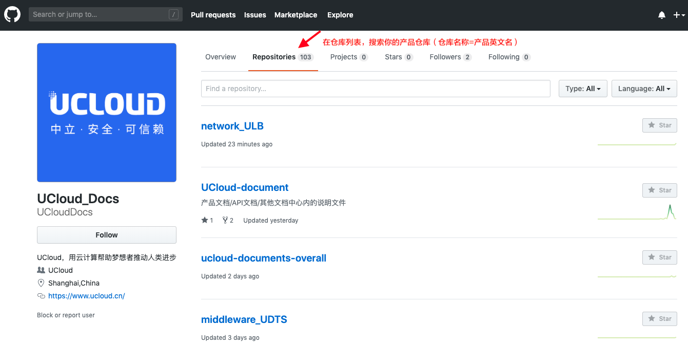
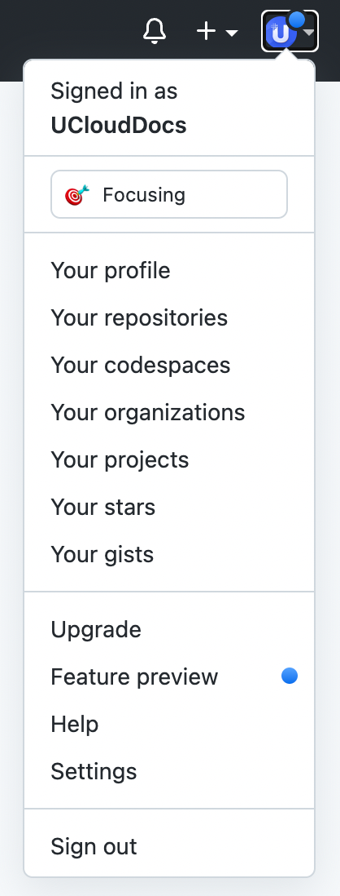

# GitHub文档仓库管理指南

> 🎯 **目标**：15分钟内完成账号准备和权限配置，快速掌握GitHub文档仓库的创建、管理和维护

## 🚀 快速上手指南

### Step 1: 注册GitHub账号

#### 📝 注册要求
- **必须使用UCloud邮箱**注册GitHub账号
- 记住您的用户名和注册邮箱

#### 🔗 注册步骤
1. 前往 [GitHub官网](https://github.com)
2. 点击"Sign up"注册
3. 使用UCloud邮箱完成注册流程

### Step 2: 申请仓库权限

#### 📋 信息提交
1. 将您的**注册邮箱**和**用户名**填写到[信息采集表](https://ones.dml.ucloud.cn/project/#/team/BVSybaCU/project/HzAusVHg137NhUev/component/AseRrBGk/document)
2. 根据需求选择：
   - **新产品/新分类/变更原产品分类**：在表格中标注并私聊平台产品经理
   - **现有产品文档**：直接填写信息即可

⚠️ **注意**：请勿随意更改其他产品及产品经理信息

#### ⏰ 等待处理
- 平台将尽快为您准备仓库并分配权限
- 通常在1个工作日内完成

### Step 3: 确认邀请邮件

#### 📧 邮件确认
1. 查收GitHub邀请邮件
2. 点击邮件中的确认链接
3. 完成权限确认流程

#### 🔍 找到您的仓库
1. 登录GitHub后前往[UCloudDocs主页](https://github.com/UCloudDoc-Team)
2. 在仓库列表中找到您的产品仓库

### Step 4: 激活发布权限

#### ⚙️ 配置GitHub设置
1. 确保GitHub账号的**Primary Email**是UCloud邮箱
2. 登录GitHub，进入**Settings**

3. 前往**Email**配置，**取消勾选**"Keep my email addresses private"
> 若仍旧无法激活发布权限，请确保账号的Primary email是注册账号时对应的UCloud邮箱。因为发布地址用到公司sso鉴权，通过ucloud邮箱关联你的github账号与内部平台。

4. 在任意仓库文章中进行一次修改并**Commit**

#### ✅ 验证权限
完成上述步骤后，前往[发布页面](https://cms-docs.ucloudadmin.com/ucpublishnew.html)验证是否获得发布权限。

### Step 5: 开始创作

#### 🎯 权限说明
- 受邀账号对所在仓库拥有**master权限**
- 默认编辑发生在master分支上
- **建议**：参照[协同编辑指南](02-repository-guide?id=🤝-如何协同编辑)，创建分支进行日常编辑

### 📋 核心操作流程
1. **[仓库了解](02-repository-guide.md)** - 理解仓库结构
2. **[创建文档](03-create-docs.md)** - 新建和编辑文档
3. **[发布管理](04-publish-guide.md)** - 预览和发布文档
4. **[高级功能](05-advanced-features.md)** - 样式、图标等进阶用法

🎉 **恭喜！** 完成以上步骤后，您就可以开始文档创作之旅了！
💡 **提示**：建议收藏本页面，作为日常操作的快速入口。