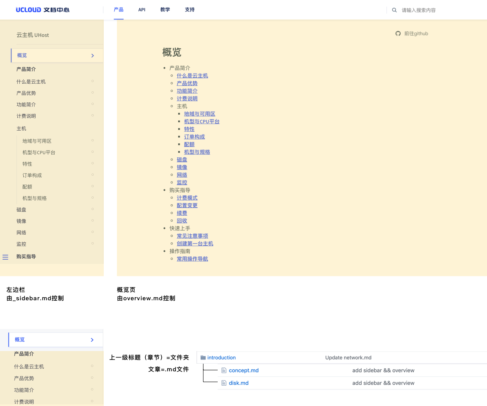
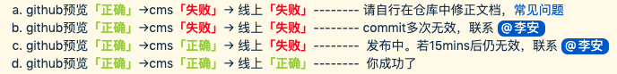
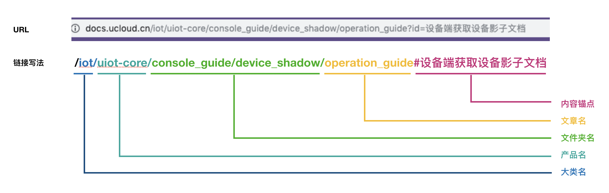
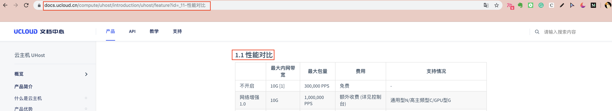

# 仓库结构详解

> 🎯 **目标**：理解文档仓库的组织方式和文件结构

## 📁 仓库结构概览

```
您的产品仓库/
├── _sidebar.md          # 左侧导航菜单
├── README.md          # 产品概览页面
├── images/              # 图片资源文件夹
│   ├── screenshot1.png
│   └── diagram.jpg
├── introduction/        # 产品介绍章节
│   ├── concept.md
│   └── features.md
└── guide/              # 操作指南章节
    ├── quickstart.md
    └── advanced.md
```



## 🗂️ 核心文件说明

### 1. _sidebar.md - 左侧导航控制

**作用**：控制页面左侧导航菜单的显示

**重要提醒**：
- 文件名必须是 `_sidebar.md`，下划线不能丢失
- 每次增减/修改文档时，都要更新这个文件

**基本格式**：
```markdown
<!-- 空行不要删除！！！ -->
* [概览](/uhost/README)
* 产品简介
    * [什么是云主机](/uhost/introduction/concept)
    * [产品优势](/uhost/introduction/advantages)
```

> 产品图标如何添加：若控制台产品已有icon则联系@汪林添加。若没有则提交ones视觉需求并@冯逸琪安排视觉设计后再联系平台侧添加。

### 2. README.md - 产品概览页

**作用**：作为文档首页，提供产品整体介绍

**内容建议**：
- 产品简介
- 功能概览
- 文档目录（可直接复制sidebar内容）
- 快速链接

**命名说明**：
- 推荐使用`README.md`作为文档首页
- 您可以自由命名，只要保证文件名唯一性

### 3. images/ - 图片资源文件夹

**图片管理方式**：

#### 方式一：相对地址引用（推荐）
```markdown

```

#### 方式二：绝对地址引用
使用图床服务，[详细说明](http://docs.ucloudadmin.com/5b10f62667ded1519074449f/edit)


## 📝 文档文件规范

### 📂 文件夹命名规则
- **仅支持**：英文字母、英文下划线、英文连字符
- **不支持**：中文、特殊符号、空格
- 同层级下文件夹不得重名

### 📄 Markdown文档规范

#### 文件命名
- 必须以`.md`结尾
- 仅支持：英文字母、英文下划线、英文连字符
- 同层级下文件不得重名

#### 内容规范
- **文章标题使用H1**：`# 标题内容`
- 标题应与sidebar.md中的目录标题一致
- 遵循GitHub Markdown语法规范
- 及时前往[CMS预览](cms.docs.ucloudadmin.com)检查效果

#### 自检技巧
预览样式不正确时，可以这样快速排查：



## 🔗 文档链接规范

### 内部文档跳转

#### 方式一：绝对链接（推荐）
直接使用目标文档的线上URL
```markdown
[链接文字](https://docs.ucloud.cn/uhost/introduction/concept)
```

#### 方式二：相对地址
```markdown
[链接文字](../introduction/concept)
```



### 段落锚点链接

**如何获取段落链接**：
1. 在目标文档中点击段落标题
2. 复制浏览器地址栏中带锚点的URL



**注意**：新平台不再支持手写`#`锚点，请使用上述方法获取准确链接。

## 🤝 如何协同编辑

### 分支管理建议
虽然您拥有master权限，但为了规避风险，建议：

1. **创建工作分支**进行日常编辑
2. **测试确认**后再合并到master
3. **重要更新**前先备份

### 协作者管理
- 可邀请协作者（上限3名）
- 不可擅自邀请外部人员
- 涉及人员变动需联系平台产品经理

## ✅ 文档质量检查清单

### 📋 发布前检查
- [ ] 文件和文件夹命名符合规范
- [ ] _sidebar.md已更新
- [ ] 文档标题使用H1格式
- [ ] 图片链接正确显示
- [ ] 内部链接可正常跳转
- [ ] 在CMS预览页面确认样式

### 🔍 定期维护
- [ ] 检查链接有效性
- [ ] 更新过时截图
- [ ] 优化文档结构
- [ ] 收集用户反馈

---

🎯 **下一步**：[创建第一个文档](03-create-docs.md)