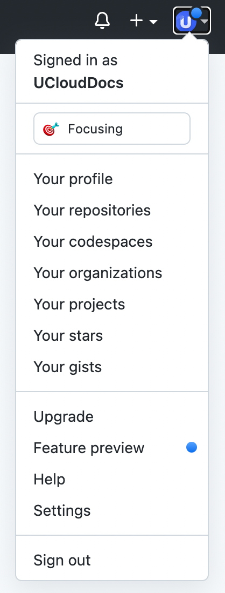

# 发布与预览指南

> 🎯 **目标**：掌握文档的预览、发布和权限管理流程

## 🔍 实时预览

### 📱 预览功能
我们支持文档的实时预览功能：
- 仓库内的所有变更都可以实时查看
- 无需等待发布即可预览效果
- 支持样式、图片、链接的完整预览

### 🔗 预览入口
1. 前往[发布页面](https://cms-docs.ucloudadmin.com/ucpublishnew.html)
2. 找到您的产品文档
3. 点击"**[预览地址](https://cms-docs.ucloudadmin.com/)**"按钮

### 💡 预览最佳实践
- **每次编辑后**都要预览检查
- **发布前**必须完整预览
- **重点检查**：样式、图片、链接、导航

## 🚀 文档发布

### 📋 发布前检查清单

#### ✅ 权限确认
- [ ] 拥有仓库master权限
- [ ] GitHub邮箱已公开
- [ ] Primary邮箱是UCloud邮箱
- [ ] 已完成至少一次commit

#### ✅ 内容检查
- [ ] 文档内容完整准确
- [ ] 图片显示正常
- [ ] 链接可正常访问
- [ ] 导航菜单正确
- [ ] 预览效果符合预期

### 🎯 发布操作

1. **进入发布页面**
   访问：[发布页面](https://cms-docs.ucloudadmin.com/ucpublishnew.html)

2. **选择文档**
   在列表中找到您的产品文档

3. **执行发布**
   点击"**发布**"按钮

4. **确认发布**
   等待发布完成提示

### ⏰ 发布时机建议

#### 🟢 适合发布的时机
- 内容已完整编写和校对
- 预览效果完全符合预期
- 所有链接和图片正常
- 已通过内部审核

#### 🔴 不适合发布的情况
- 内容尚未完成
- 存在明显错误
- 图片或链接失效
- 格式混乱

## 🔐 发布权限管理

### 🚨 权限问题排查

如果您无法发布，请按以下步骤排查：

#### Step 1: 检查GitHub邮箱设置

1. **确认Primary邮箱**
   - 登录GitHub
   - 进入Settings → Emails
   - 确认Primary邮箱是UCloud邮箱

2. **公开邮箱地址**
   - 在Emails设置页面
   - **取消勾选**"Keep my email addresses private"
   
   
   

#### Step 2: 确认仓库权限

1. **检查权限级别**
   - 进入您的仓库
   - 查看是否显示"master"权限
   - 确认可以直接编辑文件

2. **联系管理员**
   如果权限不足，联系：
   - 平台产品经理
   - 主仓库管理者

#### Step 3: 完成首次提交

1. **进行任意修改**
   - 在仓库中任选一篇文档
   - 进行小的修改（如添加空行）
   - 填写commit信息并提交

2. **验证权限**
   - 等待几分钟
   - 重新访问发布页面
   - 检查是否获得发布权限

### 🔧 权限激活步骤

**完整的权限激活流程**：

1. ✅ 使用UCloud邮箱注册GitHub
2. ✅ 设置UCloud邮箱为Primary邮箱
3. ✅ 取消"Keep Private"设置
4. ✅ 获得仓库master权限
5. ✅ 完成至少一次commit操作
6. ✅ 前往发布页面验证权限

## 📊 发布后管理

### 🔄 更新发布

#### 内容更新流程
1. 在GitHub中修改文档
2. 提交更改
3. 预览检查效果
4. 重新发布

#### 更新频率建议
- **重要更新**：立即发布
- **日常维护**：定期批量发布
- **紧急修复**：优先发布

### 📈 发布质量监控

#### 发布后检查
- [ ] 线上内容显示正确
- [ ] 所有功能正常工作
- [ ] 用户反馈收集
- [ ] 访问数据监控

#### 问题处理
- **发现问题**：立即修复并重新发布
- **用户反馈**：及时响应和处理
- **定期优化**：根据数据优化内容

---
[❓ 发布与预览](10-faq?id=🚀-发布和预览问题)

🎯 **下一步**：[高级功能使用](05-advanced-features.md)