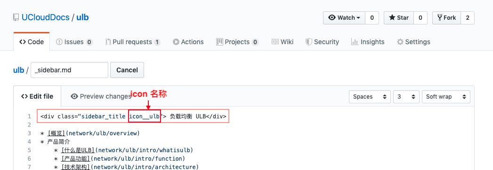

# 高级功能使用指南

> 🎯 **目标**：掌握文档平台的高级样式和功能，提升文档表现力

## 🎨 样式功能

### 🏷️ Tabs标签页

**使用场景**：展示多种配置方式、不同平台的操作步骤等

**语法格式1**：
```html
<!-- tabs:start -->

#### **English**

Hello!

#### **French**

Bonjour!

#### **Italian**

Ciao!

<!-- tabs:end -->

```
**语法格式2**：
```html
<!-- tabs:start -->

<!-- tab:English -->

Hello!

<!-- tab:French -->

Bonjour!

<!-- tab:Italian -->

Ciao!

<!-- tabs:end -->

```

**实际示例**：
```html
<!-- tabs:start -->
<!-- tab:控制台操作 -->

1. 登录UCloud控制台
2. 进入产品页面
3. 点击创建按钮

<!-- tab:API调用 -->

```bash
curl -X POST \
  https://api.ucloud.cn/create \
  -H 'Content-Type: application/json'
```

<!-- tabs:end -->
```

**注意事项**：
- 支持在tab内使用所有Markdown语法
- 标签名称要简洁明了

### 💡 提示样式

**使用场景**：重要提醒、注意事项、警告信息等

#### 信息提示
```html
<div class="alert alert-info">
<strong>信息：</strong>这是一条信息提示
</div>
```

#### 成功提示
```html
<div class="alert alert-success">
<strong>成功：</strong>操作已完成
</div>
```

#### 警告提示
```html
<div class="alert alert-warning">
<strong>警告：</strong>请注意以下事项
</div>
```

#### 错误提示
```html
<div class="alert alert-danger">
<strong>错误：</strong>操作失败，请检查配置
</div>
```

### 🔗 超链接样式

#### 基础链接
```markdown
[链接文字](https://链接地址)
```

#### 按钮样式链接
```html
<a href="https://链接地址" class="btn btn-primary">按钮文字</a>
```

#### 新窗口打开
```html
<a href="https://链接地址" target="_blank">链接文字</a>
```

### 📝 副标题功能

**使用场景**：为文档添加补充说明或更新信息

```markdown
# 主标题
## 副标题说明
> 最后更新：2023-12-01
```

### 📋 内容目录

**自动生成目录**：平台支持自动抓取文章内的二级标题生成目录

**手动目录**：
```markdown
## 目录
- [章节1](#章节1)
- [章节2](#章节2)
  - [子章节2.1](#子章节21)
  - [子章节2.2](#子章节22)
```

## 🎯 图标功能

### 🖼️ 产品图标设置

**功能说明**：在左侧导航栏显示产品图标

**设置步骤**：

1. **查找图标**
   - 访问[图标库](https://console-font.pre.ucloudadmin.com/www/preview)
   - 找到对应的产品图标
   - 记录图标名称（如：`icon_ulb`）

2. **配置图标**
   在`_sidebar.md`文件首行添加：
   ```html
   <div class="sidebar_title icon__产品图标名"> 产品名称</div>
   ```

3. **示例配置**
   ```html
   
   ```

**注意事项**：
- 需要在**产品文档**和**API文档**的sidebar中都添加
- 图标名称格式：`icon__` + 图标名
- 确保图标名称正确，否则不显示



### 🎨 图标使用技巧

#### 常用产品图标
- 云主机：`icon__uhost`
- 负载均衡：`icon__ulb`
- 云数据库：`icon__udb`
- 对象存储：`icon__ufile`

#### 图标显示问题排查
1. 检查图标名称是否正确
2. 确认class格式是否准确
3. 验证图标库中是否存在该图标
4. 清除缓存重新加载

## 🔧 代码高亮

### 📝 支持的语言

平台支持多种编程语言的语法高亮：

#### 常用语言
- **JavaScript**: `javascript` 或 `js`
- **Python**: `python` 或 `py`
- **Java**: `java`
- **Go**: `go`
- **Shell**: `bash` 或 `shell`
- **JSON**: `json`
- **YAML**: `yaml` 或 `yml`
- **XML**: `xml`
- **SQL**: `sql`
- **PHP**: `php`
- **C++**: `cpp`
- **C#**: `csharp`

#### 配置文件
- **Nginx**: `nginx`
- **Apache**: `apache`
- **Docker**: `dockerfile`
- **Kubernetes**: `yaml`

### 💻 代码块使用

#### 基础语法
```markdown
```语言名称
代码内容
```
```

#### 实际示例

**JavaScript代码**：
```markdown
```javascript
function hello() {
    console.log("Hello World!");
}
```
```

**Shell命令**：
```markdown
```bash
sudo apt-get update
sudo apt-get install nginx
```
```

**JSON配置**：
```markdown
```json
{
    "name": "example",
    "version": "1.0.0"
}
```
```

### 🎯 代码块最佳实践

1. **选择合适的语言标识**
   - 使用准确的语言名称
   - 保持一致的命名风格

2. **代码格式化**
   - 保持适当的缩进
   - 添加必要的注释
   - 删除敏感信息

3. **示例完整性**
   - 提供可运行的完整示例
   - 包含必要的导入语句
   - 说明运行环境要求

## 🎬 多媒体支持

### 🎥 视频支持

**支持格式**：`.mp4`

**嵌入方式**：
```html
<video width="100%" controls>
  <source src="images/demo.mp4" type="video/mp4">
  您的浏览器不支持视频播放。
</video>
```

### 🎞️ GIF动图

**使用场景**：操作演示、流程说明

**嵌入方式**：
```markdown

```

**制作建议**：
- 控制文件大小（建议<5MB）
- 保持清晰度
- 突出关键操作

## 📊 表格高级功能

### 📋 表格对齐

```markdown
| 左对齐 | 居中对齐 | 右对齐 |
|:-------|:--------:|-------:|
| 内容1  |   内容2  |  内容3 |
```

### 🎨 表格样式

```html
<table class="table table-striped">
<thead>
<tr>
<th>列标题1</th>
<th>列标题2</th>
</tr>
</thead>
<tbody>
<tr>
<td>内容1</td>
<td>内容2</td>
</tr>
</tbody>
</table>
```

## 🔄 收起展开功能

**使用场景**：长内容折叠、可选内容隐藏

```html
<details>
<summary>点击展开详细内容</summary>

这里是折叠的内容...

可以包含任何Markdown语法。

</details>
```

## 📱 响应式设计

### 📐 图片响应式

```html

```

### 📊 表格响应式

```html
<div class="table-responsive">
<table class="table">
<!-- 表格内容 -->
</table>
</div>
```

---

🎯 **下一步**：[本地编辑工具](07-local-editing.md)
