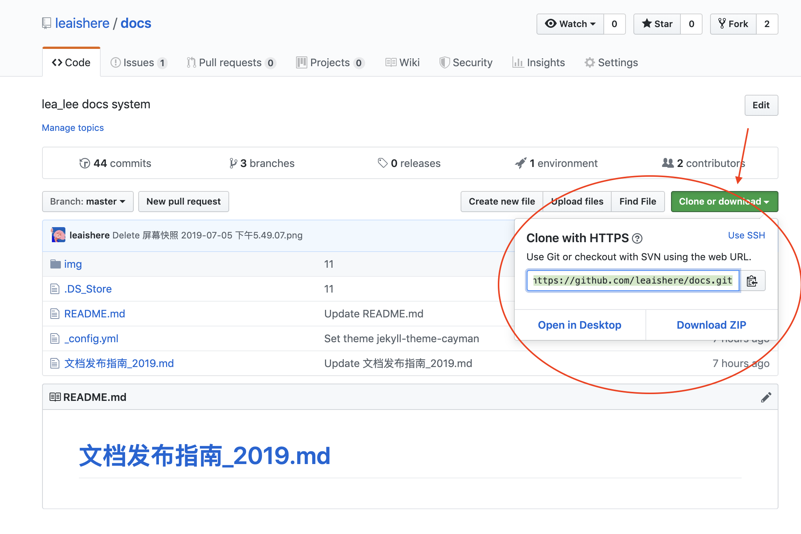
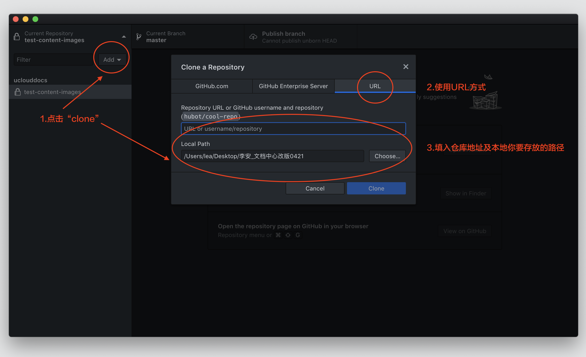
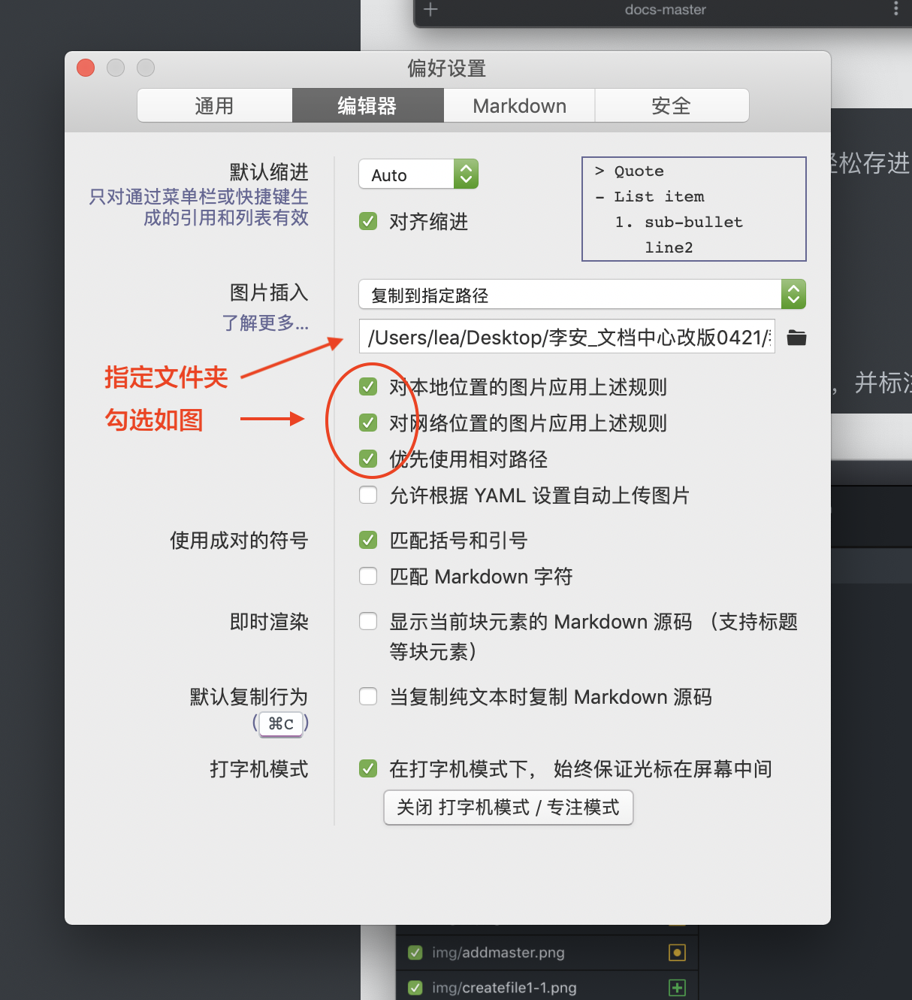
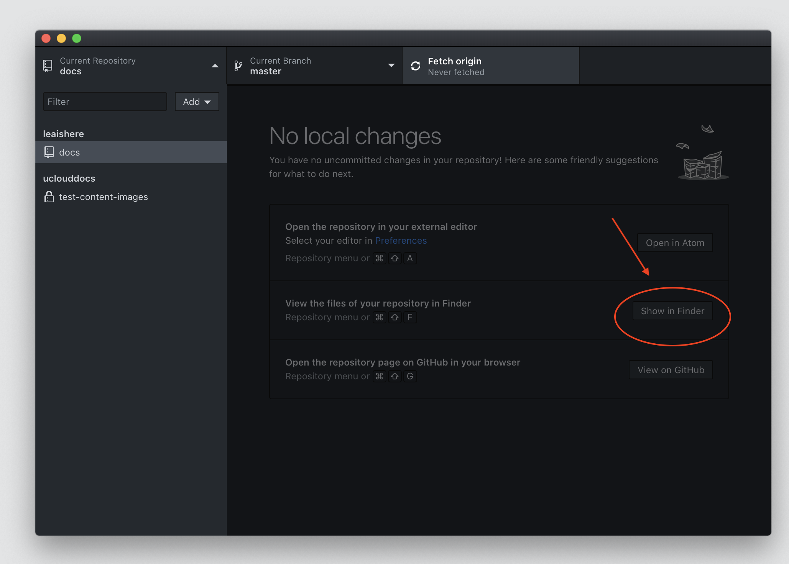
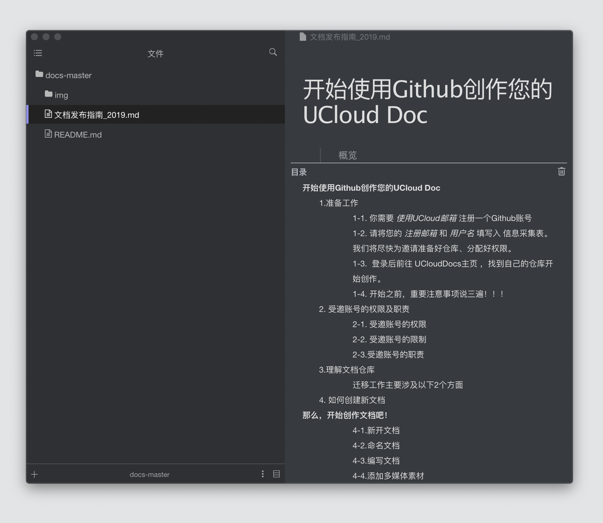
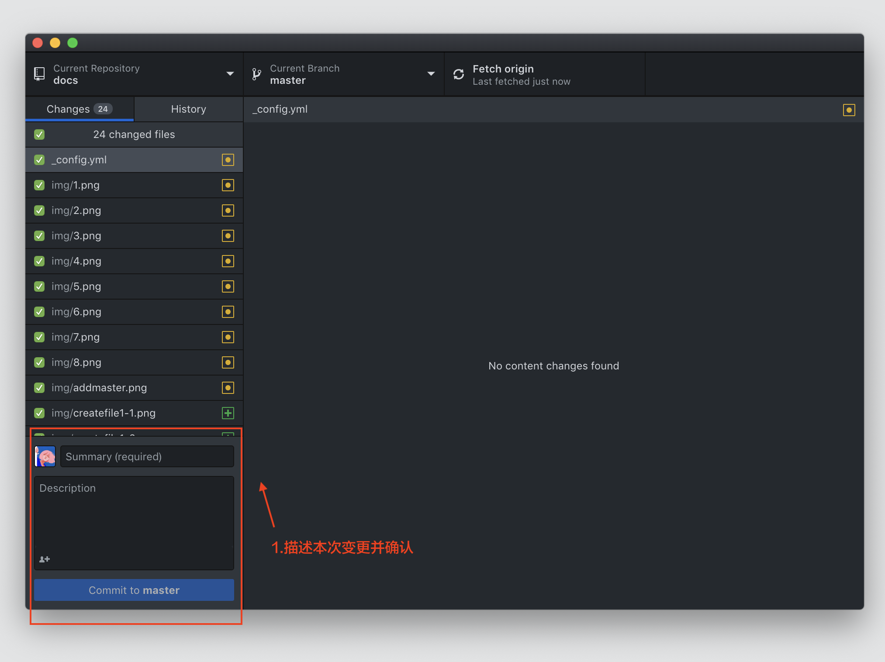
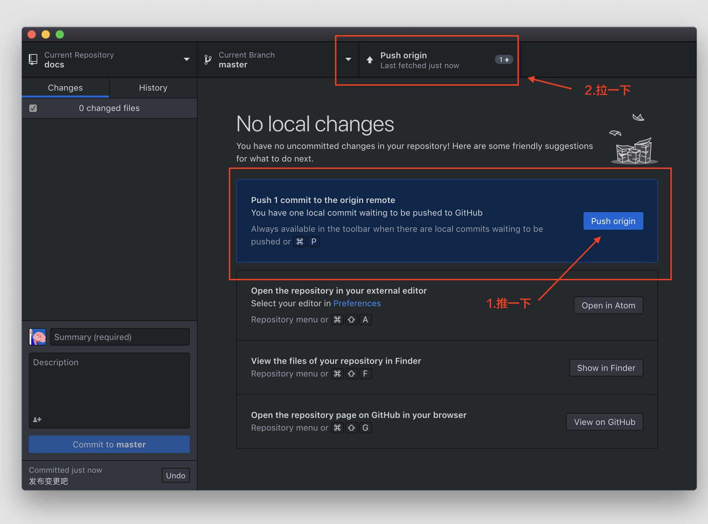

# 本地编辑工具指南

> 🎯 **目标**：掌握使用Typora + GitHub Desktop进行高效本地文档编辑

## 🛠️ 工具准备

### 📥 下载必备工具

#### GitHub Desktop客户端
- **下载地址**：[GitHub Desktop](https://desktop.github.com/)
- **支持平台**：Windows / macOS
- **主要功能**：仓库同步、版本管理、可视化操作

#### Typora编辑器
- **下载地址**：[Typora](https://www.typora.io/)
- **支持平台**：Windows / macOS / Linux
- **主要功能**：所见即所得Markdown编辑、实时预览

### 💡 工具优势

#### GitHub Desktop优势
- 🔄 **可视化操作**：无需命令行，图形界面友好
- 📊 **变更对比**：清晰显示文件修改内容
- 🌿 **分支管理**：轻松创建和切换分支
- 📝 **提交历史**：完整的版本变更记录

#### Typora优势
- ✍️ **实时预览**：编辑即预览，所见即所得
- 🖼️ **图片管理**：拖拽插入，自动整理
- 📁 **文件树**：侧边栏文件导航
- 🎨 **主题支持**：多种编辑主题选择

## 🚀 环境配置

### Step 1: 配置GitHub Desktop

#### 登录账号
1. 打开GitHub Desktop
2. 点击"Sign in to GitHub.com"
3. 输入您的GitHub账号和密码
4. 完成授权登录

#### 配置用户信息
1. 进入 **Preferences** (macOS) 或 **Options** (Windows)
2. 在 **Git** 标签页设置：
   - **Name**: 您的姓名
   - **Email**: UCloud邮箱地址

### Step 2: 克隆仓库到本地

#### 方式一：通过GitHub Desktop克隆
1. 在GitHub Desktop中点击"Clone a repository from the Internet"
2. 选择"GitHub.com"标签页
3. 找到您的产品仓库（如：UCloudDocs/uhost）
4. 选择本地存储路径
5. 点击"Clone"开始克隆

#### 方式二：通过URL克隆
1. 在GitHub网页上找到您的仓库
2. 点击绿色"Code"按钮，复制HTTPS链接
3. 在GitHub Desktop中选择"Clone a repository from the Internet"
4. 选择"URL"标签页，粘贴链接
5. 选择本地路径并克隆

### Step 3: 配置Typora

#### 基础设置
1. 打开Typora
2. 进入 **偏好设置** / **Preferences**
3. 推荐配置：
   - **主题**：选择舒适的编辑主题
   - **编辑器**：启用行号、代码块行号
   - **图像**：配置图片插入规则

#### 图片管理配置
1. 在偏好设置中找到"图像"选项
2. 设置"插入图片时"为"复制到指定路径"
3. 设置路径为：`./images`
4. 勾选"对本地位置的图片应用上述规则"

**配置效果**：
- 拖拽图片到文档时自动复制到images文件夹
- 自动生成正确的相对路径引用
- 保持仓库结构整洁

## ✍️ 本地编辑流程

### 📝 日常编辑步骤

#### Step 1: 同步最新内容
1. 打开GitHub Desktop
2. 选择您的仓库
3. 点击"Fetch origin"获取最新更新
4. 如有更新，点击"Pull origin"同步到本地

#### Step 2: 创建工作分支（推荐）
1. 在GitHub Desktop中点击"Current Branch"
2. 点击"New Branch"
3. 输入分支名称（如：`feature/new-docs`）
4. 点击"Create Branch"

#### Step 3: 使用Typora编辑
1. 在本地文件夹中找到克隆的仓库
2. 右键选择"用Typora打开"或直接拖拽到Typora
3. 在Typora中开启文件树视图：**视图** → **侧边栏** → **文件树**

#### Step 4: 编辑文档
1. 在文件树中选择要编辑的文档
2. 使用Typora的所见即所得编辑功能
3. 实时预览编辑效果

#### Step 5: 添加图片
1. 直接拖拽图片到文档中
2. Typora自动复制到images文件夹
3. 自动生成正确的引用路径

### 🔄 提交和同步

#### Step 1: 查看变更
1. 回到GitHub Desktop
2. 查看"Changes"标签页
3. 检查所有修改的文件
4. 预览具体的变更内容

#### Step 2: 提交变更
1. 在左下角"Summary"中输入提交说明
2. 可选：在"Description"中添加详细描述
3. 点击"Commit to [分支名]"

**提交信息建议**：
- 简洁明了：`添加产品介绍文档`
- 具体描述：`更新API文档，修复示例代码错误`
- 分类标识：`docs: 更新快速上手指南`

#### Step 3: 推送到远程
1. 点击"Push origin"将变更推送到GitHub
2. 等待推送完成

#### Step 4: 创建Pull Request（如使用分支）
1. 在GitHub网页上会出现"Compare & pull request"提示
2. 点击创建Pull Request
3. 填写PR描述
4. 请求审核或直接合并到master

## 🎯 高效编辑技巧

### ⌨️ Typora快捷键

#### 格式化快捷键
- **粗体**：`Ctrl/Cmd + B`
- **斜体**：`Ctrl/Cmd + I`
- **代码**：`Ctrl/Cmd + Shift + C`
- **链接**：`Ctrl/Cmd + K`

#### 结构快捷键
- **标题1-6**：`Ctrl/Cmd + 1-6`
- **无序列表**：`Ctrl/Cmd + Shift + ]`
- **有序列表**：`Ctrl/Cmd + Shift + [`
- **表格**：`Ctrl/Cmd + T`

#### 视图快捷键
- **源码模式**：`Ctrl/Cmd + /`
- **专注模式**：`F8`
- **打字机模式**：`F9`

### 📁 文件管理技巧

#### 文件组织
1. **按功能分类**：introduction、guide、api等
2. **统一命名规范**：使用英文、下划线、连字符
3. **保持结构清晰**：避免过深的目录层级

#### 图片管理
1. **统一存放**：所有图片放在images文件夹
2. **有意义命名**：`feature-overview.png`而不是`image1.png`
3. **控制大小**：压缩图片，建议单张<1MB
4. **格式选择**：截图用PNG，照片用JPG

### 🔍 预览和检查

#### 本地预览
1. **Typora预览**：实时查看渲染效果
2. **浏览器预览**：使用Markdown预览插件
3. **移动端检查**：确保响应式效果

#### 提交前检查
- [ ] 文档格式正确
- [ ] 图片显示正常
- [ ] 链接可以访问
- [ ] 拼写检查完成
- [ ] 结构逻辑清晰

## 🔧 高级功能

### 🌿 分支管理策略

#### 分支命名规范
- **功能开发**：`feature/功能名称`
- **问题修复**：`fix/问题描述`
- **文档更新**：`docs/更新内容`
- **紧急修复**：`hotfix/紧急问题`

#### 工作流程
1. **master分支**：保持稳定，用于发布
2. **开发分支**：日常编辑和修改
3. **定期合并**：测试无误后合并到master
4. **标签管理**：重要版本打标签

### 📊 版本管理

#### 提交历史管理
1. **查看历史**：在GitHub Desktop中查看提交历史
2. **版本对比**：比较不同版本的差异
3. **版本回退**：必要时回退到之前版本

#### 冲突解决
1. **预防冲突**：及时同步，避免长时间不更新
2. **解决冲突**：使用GitHub Desktop的冲突解决工具
3. **团队协作**：建立清晰的协作规范

---
[❓ AI编辑FAQ](10-faq?id=💻-本地编辑问题)

🎯 **下一步**：[截图规范指南](07-screenshot-guide.md)
