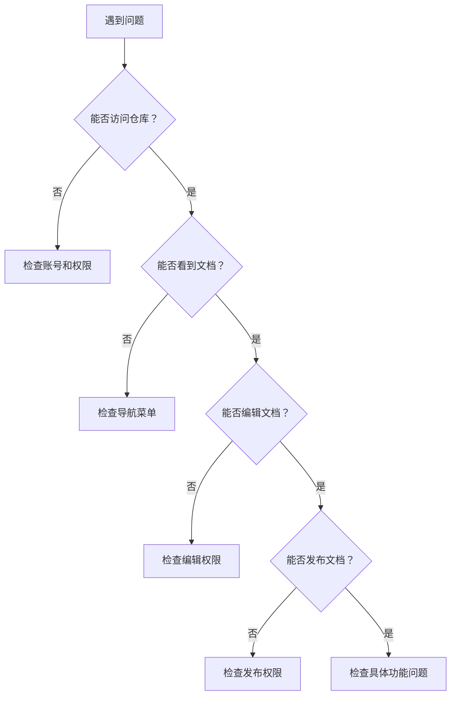

# 常见问题解答

> 🆘 **目标**：快速解决使用过程中的常见问题

## 📋 问题分类导航

### 🚀 [快速定位问题](#快速定位问题)
- [账号和权限问题](#账号和权限问题)
- [文档创建问题](#文档创建问题)
- [发布和预览问题](#发布和预览问题)
- [格式和样式问题](#格式和样式问题)
- [图片和媒体问题](#图片和媒体问题)
- [导航和菜单问题](#导航和菜单问题)
- [本地编辑问题](#本地编辑问题)
- [权限和安全问题](#权限和安全问题)

## 🔍 快速定位问题

### 问题诊断流程



### 🎯 问题快速匹配

| 症状描述 | 可能原因 | 快速跳转 |
|----------|----------|----------|
| 收不到邀请邮件 | 邮箱设置问题 | [邮箱问题](#q-收不到github邀请邮件怎么办) |
| 左侧菜单不显示 | sidebar文件问题 | [菜单问题](#q-左侧目录无法显示文档入口) |
| 无法发布文档 | 发布权限未激活 | [发布问题](#q-如何激活发布权限) |
| 图片无法显示 | 图片路径错误 | [图片问题](#q-图片无法正常显示) |
| 格式显示异常 | Markdown语法错误 | [格式问题](#q-文档格式显示不正确) |
| 本地同步失败 | Git配置问题 | [同步问题](#q-本地修改无法同步到线上) |

## 👤 账号和权限问题

### Q: 收不到GitHub邀请邮件怎么办？

**A: 邮箱设置解决方案**

#### 检查邮箱设置

1. **登录GitHub账号**
   - 访问 [GitHub设置页面](https://github.com/settings/emails)
   - 检查邮箱地址是否正确
   - 确认邮箱已验证（显示绿色✓）

2. **检查邮件过滤**
   - 查看垃圾邮件文件夹
   - 检查邮件过滤规则
   - 将 `noreply@github.com` 添加到白名单

3. **重新发送邀请**
   - 联系仓库管理员重新发送邀请
   - 确认使用正确的邮箱地址

#### 邮箱配置步骤

**Step 1: 访问邮箱设置**
```
1. 登录GitHub
2. 点击右上角头像
3. 选择 "Settings"
4. 点击左侧 "Emails"
```

**Step 2: 验证邮箱**
```
1. 如果邮箱未验证，点击 "Resend verification email"
2. 检查邮箱收到的验证邮件
3. 点击邮件中的验证链接
4. 确认邮箱状态变为已验证
```

**Step 3: 配置通知设置**
```
1. 访问 "Settings" > "Notifications"
2. 确保 "Email" 选项已启用
3. 检查 "Repository invitations" 是否启用
```

> 💡 **提示**：如果仍然收不到邮件，可以尝试使用其他邮箱地址

### Q: 如何申请仓库访问权限？

**A: 权限申请流程**

#### 申请步骤

1. **准备申请信息**
   - GitHub用户名
   - 注册邮箱地址
   - 申请理由说明
   - 需要的权限级别

2. **提交申请**
   - 更新[仓库管理员登记表](https://ones.dml.ucloud.cn/wiki/#/team/BVSybaCU/space/PnULfhek/page/6zwqSBpV)并联系管理员@李安

3. **等待审核**
   - 管理员审核申请并更新仓库管理员
   - 仓库管理权限更新后，Github平台会发送邀请邮件

4. **接受邀请**
   - 检查邮箱收到的邀请邮件
   - 点击邮件中的接受链接
   - 确认权限生效

> 确保Github已登录后再点击激活邮件链接。确定目标仓库编辑态下，提交按钮显示「Commit」则表示仓库管理权限已获得。

### Q: 权限不足无法编辑文档？

**A: 权限检查和解决**

#### 检查当前权限

1. **访问仓库页面**
   - 查看是否能看到 "Edit" 按钮
   - 检查是否能创建新文件
   - 确认是否能提交更改

2. **确认权限级别**
   - **Read**：只能查看，无法编辑
   - **Write**：可以编辑和提交
   - **Admin**：完全管理权限

#### 解决方案

```markdown
1. 联系仓库管理员申请更高权限
2. 确认是否在正确的分支上操作
3. 检查是否有分支保护规则
4. 尝试通过Pull Request提交更改
```

## 📝 文档创建问题

### Q: 如何创建新的文档文件？

**A: 文档创建步骤**

#### 在GitHub网页端创建

**Step 1: 进入目标目录**
```
1. 访问仓库主页
2. 导航到要创建文档的目录
3. 点击 "Add file" > "Create new file"
```

**Step 2: 命名文件**
```
1. 输入文件名（必须以.md结尾）
2. 如需创建子目录，使用 "folder/filename.md" 格式
3. 确保文件名符合命名规范
```

**Step 3: 编写内容**
```
1. 在编辑器中输入Markdown内容
2. 使用预览功能检查格式
3. 添加必要的元数据和标题
```
> 完整教程查看[创建文档](03-create-docs.md)

**Step 4: 提交文件**
```
1. 滚动到页面底部
2. 填写提交信息
3. 选择提交到主分支或创建新分支
4. 点击 "Commit new file"
```
>提交后记得前往[预览页面](https://cms-docs.ucloudadmin.com/)查看更新是否生效。确认生效才可以[发布](https://cms-docs.ucloudadmin.com/ucpublishnew.html)


#### 文件命名规范

```markdown
✅ 正确示例：
- quick-start.md
- user-guide.md
- api-reference.md
- getting-started/installation.md

❌ 错误示例：
- Quick Start.md（包含空格）
- 用户指南.md（中文文件名）
- guide.txt（错误扩展名）
- Guide.MD（大写扩展名）
```

### Q: 如何组织文档结构？

**A: 文档结构最佳实践**

#### 推荐目录结构

```
docs/
├── README.md                 # 项目首页
├── _sidebar.md              # 导航菜单
├── README.md              # 产品概览
├── getting-started/         # 入门指南
│   ├── quick-start.md
│   ├── installation.md
│   └── basic-config.md
├── user-guide/              # 用户指南
│   ├── features.md
│   ├── operations.md
│   └── best-practices.md
├── advanced/                # 高级功能
│   ├── advanced-config.md
│   ├── api-reference.md
│   └── development.md
├── faq/                     # 常见问题
│   ├── common-issues.md
│   └── troubleshooting.md
├── images/                  # 图片资源
│   ├── screenshots/
│   ├── diagrams/
│   └── icons/
└── changelog.md             # 更新日志
```

#### 结构设计原则

1. **逻辑清晰**：按功能和用户需求分类
2. **层次合理**：避免过深的目录嵌套
3. **命名统一**：使用一致的命名规范
4. **易于维护**：便于后续更新和扩展

## 🚀 发布和预览问题

### Q: 如何激活发布权限？

**A: 发布权限激活步骤**

#### 激活流程

**Step 1: 配置邮箱**
```
1. 登录GitHub账号
2. 进入 Settings > Emails
3. 确保UCloud邮箱是主邮箱（Primary）
4. 确保“Keep Private”取消勾选
```
> 因为udocs发布权限通过ucloud邮箱关联github和cms平台，因此要保证主邮箱公开可验证

**Step 2: 进行首次提交**
```
1. 在仓库中创建或编辑任意文件
2. 填写提交信息
3. 点击 "Commit changes"
4. 等待系统处理
```

**Step 3: 检查权限状态**
```
1. 访问仓库的 Settings 页面
2. 查看 Pages 设置
3. 确认发布源已配置
4. 检查发布状态
```

**Step 4: 验证发布**
```
1. 等待几分钟让系统处理
2. 访问发布的URL
3. 确认页面正常显示
4. 测试导航和链接
```

> ⚠️ **注意**：首次激活可能需要等待5-10分钟

### Q: 文档更新后没有立即生效？

**A: 发布延迟解决方案**

#### 常见原因和解决方法

1. **缓存问题**
   ```
   - 强制刷新浏览器（Ctrl+F5 或 Cmd+Shift+R）
   - 清除浏览器缓存
   - 尝试无痕模式访问
   ```

2. **构建延迟**
   ```
   - 检查仓库的 Actions 页面
   - 查看构建状态和日志
   - 等待构建完成（通常1-5分钟）
   ```

3. **配置错误**
   ```
   - 检查 _sidebar.md 文件语法
   - 验证文件路径是否正确
   - 确认Markdown语法无误
   ```

#### 发布失败怎么办？

**提示：合规问题**
```
平台发布前默认会调合规部门敏感词库进行预检，但是不同敏感词的处理方式可有不同。看到提示后请联系合规同时@朱珠，更新后方可继续发布。
```

**提示：pdf生成**
```
因为pdf是基于预览环境html渲染后自动抓取生成的，因此在发布后需要等候1-5分钟才可生成。
若报错尚未生成，请前往[文档预览地址](https://cms-docs.ucloudadmin.com/)确认文档右上角「…」悬停呼出的“pdf”按钮点击后是否内容显示正常。
显示正常才可继续发布。
```

### Q: 如何预览文档效果？

**A: 预览方法汇总**

#### 在线预览

1. **GitHub预览：属于及编及看，用于检测基础MD语法是否书写正确**
   - 在文件页面点击 "Preview" 标签
   - 查看基本的Markdown渲染效果
   - 注意：不包含自定义样式

2. **[CMS预览](https://cms-docs.ucloudadmin.com/)**：cms环境样式与线上一致，cms预览正常后发布，线上显示才可正常
   - 查看完整的发布效果
   - 包含所有样式和功能

#### 本地预览

1. **使用Typora**
   ```
   - 下载并安装Typora
   - 打开本地Markdown文件
   - 实时预览编辑效果
   ```

2. **使用docsify本地服务**
   ```bash
   # 安装docsify-cli
   npm install -g docsify-cli
   
   # 在文档目录运行
   docsify serve docs
   
   # 访问 http://localhost:3000
   ```

## 🎨 格式和样式问题

### Q: 文档格式显示不正确？

**A: 格式问题诊断和修复**

#### 常见格式问题

1. **标题格式错误**
   ```markdown
   ❌ 错误：
   #标题（缺少空格）
   # 标题 #（多余的#）
   
   ✅ 正确：
   # 标题
   ## 二级标题
   ### 三级标题
   ```

2. **列表格式错误**
   ```markdown
   ❌ 错误：
   -项目1（缺少空格）
   - 项目2
   -项目3（不一致）
   
   ✅ 正确：
   - 项目1
   - 项目2
   - 项目3
   ```

3. **链接格式错误**
   ```markdown
   ❌ 错误：
   [链接文字] (url)（空格位置错误）
   [链接文字](url "标题")（引号类型错误）
   
   ✅ 正确：
   [链接文字](url)
   [链接文字](url "标题")
   ```

4. **代码块格式错误**
   ```markdown
   ❌ 错误：
   ```代码
   console.log('hello');
   ```
   
   ✅ 正确：
   ```javascript
   console.log('hello');
   ```
   ```

#### 格式检查工具

**在线检查**
- [Markdown Lint](https://dlaa.me/markdownlint/)
- [Markdown Editor](https://markdown-editor.github.io/)

**编辑器插件**
- VS Code: Markdown All in One
- Typora: 实时预览
- Atom: Markdown Preview Plus

### Q: 表格显示异常？

**A: 表格格式修复**

#### 正确的表格语法

```markdown
| 列1 | 列2 | 列3 |
|-----|-----|-----|
| 内容1 | 内容2 | 内容3 |
| 内容4 | 内容5 | 内容6 |
```

#### 表格对齐

```markdown
| 左对齐 | 居中对齐 | 右对齐 |
|:-------|:--------:|-------:|
| 内容 | 内容 | 内容 |
```

#### 常见表格问题

1. **分隔符不一致**
   ```markdown
   ❌ 错误：
   | 列1 | 列2 |
   |-----|----|
   | 内容1 | 内容2
   
   ✅ 正确：
   | 列1 | 列2 |
   |-----|-----|
   | 内容1 | 内容2 |
   ```

2. **缺少分隔行**
   ```markdown
   ❌ 错误：
   | 列1 | 列2 |
   | 内容1 | 内容2 |
   
   ✅ 正确：
   | 列1 | 列2 |
   |-----|-----|
   | 内容1 | 内容2 |
   ```

## 🖼️ 图片和媒体问题

### Q: 图片无法正常显示？

**A: 图片问题解决方案**

#### 检查图片路径

1. **相对路径规则**
   ```markdown
   # images文件夹中的图片
   
   ```

2. **绝对路径规则**
   ```markdown
   # 使用图床地址的绝对路径
   
   ```

3. **路径检查清单**
   ```markdown
   □ 文件路径是否正确
   □ 文件名大小写是否匹配
   □ 文件扩展名是否正确
   □ 是否使用了中文路径
   □ 是否包含特殊字符
   ```

#### 图片格式要求

**支持的格式**
- ✅ PNG（推荐用于截图）
- ✅ JPG/JPEG（推荐用于照片）
- ✅ GIF（支持动图）
- ✅ SVG（矢量图形）
- ❌ BMP（不推荐）
- ❌ TIFF（不支持）

**文件大小限制**
- 单个图片：< 10MB
- 推荐大小：< 2MB
- GIF动图：< 5MB

#### 图片优化建议

1. **压缩图片**
   - 使用TinyPNG等在线工具
   - 调整图片分辨率
   - 选择合适的质量设置

2. **规范命名**
   ```
   ✅ 推荐命名：
   - login-page-screenshot.png
   - user-dashboard-overview.jpg
   - workflow-diagram.svg
   
   ❌ 避免命名：
   - 屏幕截图.png
   - IMG_001.jpg
   - 图片 (1).png
   ```

### Q: 如何添加图片说明和样式？

**A: 图片增强技巧**

#### 基础图片语法

```markdown
# 基本图片


# 带链接的图片
[](https://example.com)

# 指定图片大小（HTML语法）

```

#### 图片居中和样式

```html
<!-- 居中显示 -->
<div align="center">
  
</div>

<!-- 带边框的图片 -->


<!-- 响应式图片 -->

```

#### 图片说明文字

```markdown

*图1：系统配置界面，显示了主要的配置选项*

---

<div align="center">
  
  <br>
  <em>图2：系统整体架构图</em>
</div>
```

## 🧭 导航和菜单问题

### Q: 左侧目录无法显示文档入口？

**A: 导航菜单问题解决**

#### 检查_sidebar.md文件

1. **文件位置检查**
   ```
   ✅ 正确位置：
   docs/_sidebar.md
   
   ❌ 错误位置：
   docs/sidebar.md
   docs/_Sidebar.md
   _sidebar.md（根目录）
   ```

2. **文件内容检查**
   ```markdown
   ✅ 正确格式：
   * [首页](README.md)
   * [快速开始](getting-started.md)
     * [安装指南](installation.md)
     * [配置说明](configuration.md)
   
   ❌ 错误格式：
   - [首页](README.md)  # 使用了-而不是*
   *[快速开始](getting-started.md)  # 缺少空格
   * [安装指南] (installation.md)  # 空格位置错误
   ```

3. **路径检查**
   ```markdown
   ✅ 正确路径：
   * [文档](docs/guide.md)
   * [API](api/reference.md)
   
   ❌ 错误路径：
   * [文档](/docs/guide.md)  # 绝对路径
   * [文档](./docs/guide.md)  # 不必要的./
   * [文档](docs\guide.md)  # 错误的路径分隔符
   ```

#### 常见sidebar问题

**问题1：菜单不显示**
```markdown
原因：_sidebar.md文件不存在或位置错误
解决：在docs目录下创建_sidebar.md文件
```

**问题2：链接无法点击**
```markdown
原因：文件路径错误或文件不存在
解决：检查路径和文件是否存在
```

**问题3：层级显示错误**
```markdown
原因：缩进不正确或使用了错误的符号
解决：使用空格缩进，统一使用*符号
```

#### sidebar.md模板

```markdown
<!-- _sidebar.md -->

* [产品概览](README.md)
+ * [产品概览](README.md)

* Getting started
  * [快速上手](/仓库名/quick-start.md)
  * [基础配置](/仓库名/basic-config.md)
  * [常见问题](/仓库名/faq.md)

* User Guidebook
  * [功能介绍](/仓库名/features.md)
  * [操作指南](/仓库名/operations.md)
  * [最佳实践](/仓库名/best-practices.md)

* FAQ
  * [常见问题](/仓库名/common-issues.md)
  * [故障排除](/仓库名/troubleshooting.md)

* [更新日志](/仓库名/changelog.md)
```
> 由于方案架构问题，_sidebar.md相对路径需要以/仓库名/开头

### Q: 如何创建多级菜单？

**A: 多级菜单配置**

#### 菜单层级规则

```markdown
* 一级菜单
  * 二级菜单
    * 三级菜单
      * 四级菜单（不推荐超过3级）
```

#### 实际示例

```markdown
* [产品介绍](README.md)

* 用户指南
  * 基础功能
    * [用户管理](user-guide/basic/user-management.md)
    * [权限设置](user-guide/basic/permissions.md)
  * 高级功能
    * [API集成](user-guide/advanced/api-integration.md)
    * [自定义配置](user-guide/advanced/custom-config.md)

* 开发者文档
  * API参考
    * [认证接口](api/auth.md)
    * [用户接口](api/users.md)
  * SDK文档
    * JavaScript SDK（占位示例）
    * Python SDK（占位示例）
```

#### 菜单设计最佳实践

1. **层级控制**：建议不超过3级
2. **命名清晰**：使用简洁明了的名称
3. **逻辑分组**：按功能或用户类型分组
4. **顺序合理**：按使用频率或重要性排序

## 💻 本地编辑问题

### Q: 本地修改无法同步到线上？

**A: Git同步问题解决**

#### 检查Git状态

```bash
# 检查当前状态
git status

# 检查远程仓库
git remote -v

# 检查分支
git branch -a
```

#### 常见同步问题

1. **未提交本地更改**
   ```bash
   # 添加所有更改
   git add .
   
   # 提交更改
   git commit -m "更新文档"
   
   # 推送到远程
   git push origin main
   ```

2. **分支不匹配**
   ```bash
   # 检查当前分支
   git branch
   
   # 切换到主分支
   git checkout main
   
   # 推送到正确分支
   git push origin main
   ```

3. **远程仓库冲突**
   ```bash
   # 拉取远程更新
   git pull origin main
   
   # 解决冲突后重新提交
   git add .
   git commit -m "解决冲突"
   git push origin main
   ```

#### GitHub Desktop问题

**同步失败**
```
1. 检查网络连接
2. 重新登录GitHub账号
3. 检查仓库权限
4. 尝试手动同步
```

**提交失败**
```
1. 确保有提交信息
2. 检查文件是否已添加
3. 确认有写入权限
4. 检查分支保护规则
```

### Q: Typora编辑器配置问题？

**A: Typora优化配置**

#### 基础设置

1. **文件树设置**
   ```
   菜单：视图 > 文件树
   快捷键：Ctrl+Shift+L (Windows) / Cmd+Shift+L (Mac)
   ```

2. **图片设置**
   ```
   菜单：文件 > 偏好设置 > 图像
   设置：复制图片到 ./images 文件夹
   ```

3. **主题设置**
   ```
   菜单：主题
   推荐：GitHub主题（接近最终显示效果）
   ```

#### 高级配置

**自动保存**
```
偏好设置 > 编辑器 > 自动保存
勾选：自动保存
```

**实时预览**
```
偏好设置 > 编辑器 > 实时预览
勾选：实时预览
```

**代码高亮**
```
偏好设置 > Markdown > 代码块
启用：语法高亮
```

## 🔒 权限和安全问题

### Q: 如何处理权限被误用的情况？

**A: 权限安全处理**

#### 发现权限误用

1. **立即报告**
   - 联系仓库管理员
   - 详细描述发现的问题
   - 提供相关证据截图

2. **紧急处理**
   - 管理员评估风险级别
   - 必要时临时冻结权限
   - 防止进一步损失

3. **调查分析**
   - 查看操作日志
   - 分析影响范围
   - 确定责任归属

#### 预防措施

```markdown
1. 定期审查权限设置
2. 建立操作审核机制
3. 加强安全意识培训
4. 使用最小权限原则
```

### Q: 如何安全地更换GitHub账号？

**A: 账号更换安全流程**

#### 更换前准备

1. **数据备份**
   ```
   - 导出个人贡献记录
   - 备份重要文档
   - 记录配置信息
   - 整理权限清单
   ```

2. **交接准备**
   ```
   - 整理负责的项目清单
   - 准备工作交接文档
   - 与接替人员沟通
   - 确保信息完整备份
   ```

#### 更换流程

**Step 1: 申请新权限**
```
1. 使用新账号申请权限
2. 提供身份验证材料
3. 说明账号更换原因
4. 等待管理员审核
```

**Step 2: 权限迁移**
```
1. 管理员为新账号配置权限
2. 测试新账号功能
3. 确认权限设置正确
4. 进行功能验证
```

**Step 3: 旧账号处理**
```
1. 撤销旧账号权限
2. 更新文档中的联系信息
3. 通知团队成员
4. 归档贡献记录
```

## 🛠️ 技术支持和帮助

### 📞 获取技术支持

#### 支持渠道

1. **文档自助**
   - 查阅本FAQ文档
   - 搜索相关问题解答
   - 查看操作指南

2. **社区支持**
   - GitHub Issues
   - 技术论坛
   - 用户群组

3. **官方支持**
   - 邮件支持：support@example.com
   - 在线客服：工作日 9:00-18:00
   - 电话支持：400-xxx-xxxx

#### 提交问题的最佳实践

**问题描述模板**
```markdown
**问题描述**：
简洁描述遇到的问题

**复现步骤**：
1. 第一步操作
2. 第二步操作
3. 第三步操作

**期望结果**：
描述期望看到的结果

**实际结果**：
描述实际看到的结果

**环境信息**：
- 操作系统：
- 浏览器：
- 账号权限：

**截图或日志**：
附上相关截图或错误日志
```

### 🔍 问题排查技巧

#### 系统性排查方法

1. **确认问题范围**
   - 是个人问题还是系统问题？
   - 是新问题还是历史问题？
   - 影响范围有多大？

2. **收集相关信息**
   - 错误信息和截图
   - 操作步骤记录
   - 环境和配置信息
   - 时间和频率

3. **尝试基础解决方案**
   - 刷新页面或重新登录
   - 检查网络连接
   - 清除浏览器缓存
   - 尝试其他浏览器

4. **查找相似问题**
   - 搜索FAQ文档
   - 查看GitHub Issues
   - 咨询同事或社区

#### 常用调试工具

**浏览器开发者工具**
```
打开方式：F12 或右键 > 检查元素
用途：
- 查看网络请求
- 检查控制台错误
- 分析页面结构
- 调试JavaScript
```

**GitHub状态页面**
```
URL: https://www.githubstatus.com/
用途：检查GitHub服务状态
```

**网络连接测试**
```bash
# 测试网络连接
ping github.com

# 测试DNS解析
nslookup github.com

# 测试HTTPS连接
curl -I https://github.com
```

---

## 📚 相关资源

### 🔗 官方文档链接

- [GitHub官方文档](https://docs.github.com/)
- [Markdown语法指南](https://guides.github.com/features/mastering-markdown/)
- [GitHub Pages文档](https://docs.github.com/en/pages)
- [docsify官方文档](https://docsify.js.org/)

### 🛠️ 推荐工具

- [Typora](https://typora.io/) - Markdown编辑器
- [GitHub Desktop](https://desktop.github.com/) - Git客户端
- [Snipaste](https://www.snipaste.com/) - 截图工具
- [TinyPNG](https://tinypng.com/) - 图片压缩

### 📖 学习资源

- [Git教程](https://www.liaoxuefeng.com/wiki/896043488029600)
- [Markdown教程](https://markdown.com.cn/)
- [GitHub使用指南](https://guides.github.com/)
- [技术写作指南](https://developers.google.com/tech-writing)

---

## 🎓 快速入门常见问题

### Q: 完全没有技术基础可以学会吗？

**A: 完全可以学会**

我们的指南专门为非技术人员设计：
- **零基础友好**：每个步骤都有详细的图文说明
- **渐进式学习**：从最基础的操作开始，逐步深入
- **实际案例**：提供大量实际操作示例
- **持续支持**：遇到问题可以随时寻求帮助

建议学习路径：
1. 先完成快速入门指南
2. 实际操作几次加深印象
3. 遇到问题及时查阅FAQ
4. 逐步尝试更高级的功能

### Q: 学习需要多长时间？

**A: 分阶段掌握**

**基础操作（1-2天）**：
- 文档的创建、编辑、保存
- 基本的Markdown语法
- 简单的格式调整

**熟练使用（1-2周）**：
- 复杂格式和布局
- 图片和媒体插入
- 协作和版本管理

**高级应用（1个月）**：
- 自定义样式和主题
- 高级功能配置
- 流程优化和最佳实践

记住：**实践是最好的老师**，建议边学边做。

## 📁 仓库管理常见问题

### Q: 如何将本地仓库与远程仓库关联？

**A: 关联步骤**

```bash
# 1. 初始化本地仓库
git init

# 2. 添加远程仓库地址
git remote add origin [仓库URL]

# 3. 验证关联
git remote -v

# 4. 首次推送
git push -u origin main
```

### Q: 仓库结构混乱怎么办？

**A: 重新整理结构**

1. **制定整理计划**
   - 分析现有文件和目录
   - 设计新的目录结构
   - 制定文件迁移计划

2. **执行整理操作**
   - 创建新的目录结构
   - 批量移动和重命名文件
   - 更新所有内部链接

3. **验证和测试**
   - 检查所有链接是否正常
   - 测试导航菜单功能
   - 确认文档显示正常

## 📝 文档创建进阶问题

### Q: 如何批量导入现有文档？

**A: 批量导入方法**

#### 方法一：使用GitHub网页端

1. **准备文档**
   - 将所有文档转换为Markdown格式
   - 确保文件名符合规范
   - 整理目录结构

2. **批量上传**
   - 在GitHub仓库中选择"Upload files"
   - 拖拽多个文件或文件夹
   - 等待上传完成

#### 方法二：使用Git命令行

```bash
# 1. 克隆仓库到本地
git clone [仓库URL]

# 2. 将文档复制到本地仓库目录
cp -r /path/to/docs/* ./docs/

# 3. 添加并提交
git add .
git commit -m "批量导入现有文档"
git push origin main
```

### Q: 如何设置文档模板？

**A: 模板设置方法**

1. **创建模板文件**
   - 在仓库根目录创建`.github/ISSUE_TEMPLATE/`目录
   - 或在docs目录创建`templates/`目录

2. **定义模板内容**
   ```markdown
   # 文档标题

   ## 概述
   [简要描述文档内容]

   ## 详细说明
   [详细的操作步骤或说明]

   ## 相关资源
   - [相关链接1](URL)
   - [相关链接2](URL)

   ## 更新记录
   - 创建时间：[日期]
   - 最后更新：[日期]
   - 更新人：[姓名]
   ```

## 🔧 高级功能疑难解答

### Q: 如何实现文档内容的版本控制？

**A: 版本控制策略**

#### Git分支策略

```bash
# 1. 创建开发分支
git checkout -b dev

# 2. 在开发分支进行编辑
# 进行文档修改...

# 3. 提交到开发分支
git add .
git commit -m "更新文档内容"

# 4. 切换到主分支并合并
git checkout main
git merge dev

# 5. 推送到远程
git push origin main
```

#### 版本标记

```bash
# 创建版本标签
git tag -a v1.0 -m "文档版本 1.0"
git push origin v1.0

# 查看所有版本
git tag -l
```

### Q: 如何配置自定义主题？

**A: 主题自定义步骤**

1. **创建自定义CSS**
   ```css
   /* custom.css */
   :root {
     --theme-color: #42b883;
     --text-color-base: #2c3e50;
     --text-color-secondary: #7f8c8d;
   }

   .sidebar {
     background: var(--theme-color);
   }

   .content {
     color: var(--text-color-base);
   }
   ```

2. **配置docsify加载自定义样式**
   ```html
   <!-- index.html -->
   <link rel="stylesheet" href="assets/css/custom.css">
   ```

3. **测试和调整**
   - 本地预览效果
   - 调整颜色和布局
   - 确保兼容性

## 🤖 AI编辑功能问题

### Q: AI生成的内容不够准确怎么办？

**A: 提升AI内容质量**

#### 优化输入指令

**明确具体的要求**：
```markdown
❌ 不好的指令：写一个用户指南
✅ 好的指令：为新用户编写GitHub文档创建的步骤指南，包含截图说明和常见问题解决方案
```

**提供充足的上下文**：
- 说明目标用户群体
- 指定内容的详细程度
- 明确文档的使用场景
- 提供相关的参考资料

#### 分步骤优化

1. **初步生成**：使用基础指令生成框架
2. **细节完善**：针对具体章节提供详细指令
3. **事实核查**：验证技术细节和操作步骤
4. **格式调整**：确保符合项目的格式规范

### Q: 如何让AI生成的指令更具体？

**A: 指令优化技巧**

#### 使用SMART原则

- **Specific（具体）**：明确要做什么
- **Measurable（可衡量）**：设定明确的标准
- **Achievable（可实现）**：确保要求合理
- **Relevant（相关）**：与项目目标相关
- **Time-bound（有时限）**：设定完成时间

#### 示例对比

**优化前**：
```
帮我写文档
```

**优化后**：
```
为软件产品经理编写GitHub Pages文档发布指南，要求：
1. 包含完整的操作步骤（15-20个步骤）
2. 每个步骤都要有截图说明
3. 针对可能遇到的3-5个常见问题提供解决方案
4. 使用简洁易懂的语言，避免过多技术术语
5. 整体篇幅控制在2000-3000字
```

## 💻 本地编辑深度问题

### Q: Git克隆速度太慢怎么解决？

**A: 克隆加速方法**

#### 使用镜像源

```bash
# 使用GitHub镜像
git clone https://github.com.cnpmjs.org/[用户名]/[仓库名].git

# 或者使用码云镜像（如果有同步）
git clone https://gitee.com/[用户名]/[仓库名].git
```

#### 浅克隆

```bash
# 只克隆最近的提交历史
git clone --depth 1 [仓库URL]

# 后续如需完整历史
git fetch --unshallow
```

#### 配置代理（如果网络环境需要）

```bash
# HTTP代理
git config --global http.proxy http://127.0.0.1:1080

# HTTPS代理
git config --global https.proxy https://127.0.0.1:1080

# 取消代理
git config --global --unset http.proxy
git config --global --unset https.proxy
```

### Q: Typora中图片显示异常？

**A: 图片显示问题解决**

#### 检查图片路径

1. **相对路径问题**
   ```markdown
   ❌ 错误：
   ✅ 正确：
   ```

2. **文件名问题**
   ```markdown
   ❌ 避免：中文文件名.png
   ✅ 推荐：english-filename.png
   ```

#### Typora设置优化

**图片设置**：
1. 文件 → 偏好设置 → 图像
2. 选择"复制图片到指定路径"
3. 设置路径为：`./images`
4. 启用"优先使用相对路径"

**显示设置**：
1. 视图 → 显示 → 显示图片
2. 确保图片预览功能已启用
3. 检查图片格式兼容性

### Q: 本地修改Push失败？

**A: Push失败解决方案**

#### 常见错误类型

**错误1：权限被拒绝**
```bash
# 错误信息：Permission denied (publickey)
# 解决方案：配置SSH密钥
ssh-keygen -t rsa -b 4096 -C "your_email@example.com"
```

**错误2：分支冲突**
```bash
# 错误信息：Updates were rejected
# 解决方案：先拉取再推送
git pull origin main
git push origin main
```

**错误3：文件过大**
```bash
# 错误信息：file size exceeds GitHub's limit
# 解决方案：使用Git LFS
git lfs track "*.png"
git add .gitattributes
git add large-file.png
git commit -m "Add large file with LFS"
```

## 🔐 权限和职责问题

### Q: 团队成员权限分配原则？

**A: 权限分配策略**

#### 权限层级设计

**管理员（Admin）**：
- 仓库设置和配置
- 成员邀请和权限管理
- 分支保护规则设置
- 敏感操作审批

**编辑者（Write）**：
- 创建和编辑文档
- 提交和推送更改
- 创建分支和PR
- 参与代码审查

**查看者（Read）**：
- 查看所有文档
- 下载和克隆仓库
- 提交Issue和反馈
- 参与讨论

#### 权限分配建议

```markdown
1. **项目负责人**：Admin权限
2. **核心编辑团队**：Write权限
3. **内容审核人员**：Write权限
4. **一般用户**：Read权限
5. **临时协作者**：临时Write权限
```

### Q: 如何监控文档质量？

**A: 质量监控体系**

#### 质量检查清单

**内容质量**：
- [ ] 信息准确性验证
- [ ] 逻辑结构清晰
- [ ] 语言表达规范
- [ ] 示例代码正确

**格式质量**：
- [ ] Markdown语法正确
- [ ] 图片链接有效
- [ ] 内部链接正常
- [ ] 样式统一一致

**用户体验**：
- [ ] 导航结构合理
- [ ] 搜索功能正常
- [ ] 加载速度正常
- [ ] 移动端适配

#### 自动化检查工具

```bash
# 链接检查
npm install -g markdown-link-check
markdown-link-check docs/**/*.md

# 拼写检查
npm install -g cspell
cspell "docs/**/*.md"

# 格式检查
npm install -g markdownlint-cli
markdownlint docs/**/*.md
```

---

💡 **提示**：如果本FAQ没有解决您的问题，请前往首页的「获取帮助」查看联系方式（README.md#-获取帮助）。